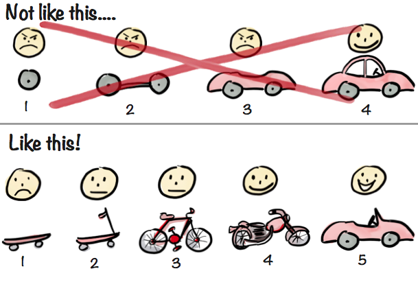

# Entry 5: Completed MVP
##### Brianna Peralta on April 15th, 2026 (04/15/26)
## Main Information:

Well, this has surely been a bit of a mess. It's officially April, the month where we participants in the Freedom Project must solidify what'll be the foundation of our final project, which is what's known as the MVP, or ***M***ost ***V***iable ***P***roduct. For anyone unaware, that essentially means a person would want a product that, while it might not be finished as time progresses, it can still be used accordingly. I feel as if this is a good image to describe how the MVP works:



Notice how, while both sides of this image represent a completed car, only the 2nd one really features a product that can still be used despite it not being a car: The left instead just shows the process of building that car, with it's parts being useless until it's all put together. That's the idea behind the ***MVP***, and while it was an uphill battle to reach it in the end, especially due to Spring Break and the fact I went out of the country for the first time in my life (I love you Dominican Republic), my partner and I finalized a project that I'm ultimately proud of now.


## The Groundwork:


As stated previously, I wanted to focus on creating the `Vocabulary` set of arrays (both its solutions and questions), and actually build a relatively unique level for it, and to do this, I started to replicate some of the original code I've created for Conjugations, and started altering it in a way that makes it feel fresh. For the questions and answers themselves, I decided to alternate having questions in both Spanish and English, keeping players on their toes so they don't get too bored from the overall experience.

```js
var conListQues = ["Hablar; Yo (Present Tense)", "Vivir; El (Present Tense)","Salir; Nosotras (Present Tense)","Beber; Ella (Present Tense)","Pintar; Ustedes (Present Tense)", "Comer; Ellas (Present Tense)", "Tener; Tu (Present Tense)", "Escuchar; Yo (Present Tense)", "Ser; Nosotros (Present Tense)", "Hacer; Usted (Present Tense)", "Ir; Ellos (Present Tense)"];
var conListAns = ["Hablo","Vive","Salimos","Bebe","Pintan", "Comen", "Tienes", "Escucho", "Somos", "Hace", "Van"];
console.log(conListQues);
var vocabListQues = ["Language", "Escuela", "Night", "Trabajando", "To Study", "Maletas", "To Travel", "Comunidad", "Future"];
var vocabListAns = ["Idioma", "School", "Noche", "Working", "Estudiar", "Suitcases", "Viajar", "Community", "Futuro"];
console.log(vocabListQues);
var movSpeed = 500;
setGravity(1000);
```

I'd also use this time to officially set up additional conditions for the different questions to show up. I know I also mentioned making it so a checkpoint and an enemy would make the questions trigger, which was done quite quickly with the help of `.onCollide(){}`. Both of them were treated as their own sprites, with the checkpoint taking the position of a portal and the enemy actually being able to chase the player in order to give them a challenge (Thank you so much for that Alberto) but still ending with the player in a.. Somewhat similar position of trivia and being sent to the beginning of the level if they were to answer incorrectly or try to submit nothing:


```js
const enemy = add([
   sprite("bean"),
   scale(.75),
   area(),
   body(),
   pos(1000,100),
   "enemy",
state("move"),
])


enemy.onStateUpdate("move", () => {
   if (!cursSprite.exists()) return
   const dir = cursSprite.pos.sub(enemy.pos).unit()
   enemy.move(dir.scale(ENEMY_SPEED))
})


cursSprite.onCollide("enemy",() => {
       go("status-con");
       })


   cursSprite.onCollide("checkpoint",() => {
       alert("Let's test your knowledge!");
       go("check-point-con");
       })
 })
})
```

As you can clearly see by the labels, the checkpoint and status update upon collision with their respective entities are specifically for Conjugation in this scenario, and this is deliberate in order to keep the 2 modes separated. But also as I had said before, both modes still end up using similar code, with the code above being a good example:

```js
scene("status-con",() => {
      var quesNum = randi(0,11);
      var ques = prompt(conListQues[quesNum]);
       if(ques == conListAns[quesNum]) {
       alert("That's correct!");
       go("plat-one-con");
   } else {
       alert("Study Harder Bozo.");
go("lose-con");
   }
   })


   scene("check-point-con",() => {
        var quesNum = randi(0,11);
      var ques = prompt(conListQues[quesNum]);
       if(ques == conListAns[quesNum]) {
       alert("That's correct! You're ready to move to the next level!");
       go("plat-one-con");
         } else {
       alert("You'll need to try again..");
       go("lose-con");
       cursSprite.pos(0,100)
   }


   })
scene("lose-con", () => {
   add([
       text("You Lose"),
   ])
   onKeyPress(() => go("plat-one-con"))
})
```

This demonstration only has 1 level for each mode, but when we begin work on the beyond MVP, I'd genuinely love to make at least 2 more levels for each mode, likely with different items in it so it feels fresh and new instead of following the basic 'enemy follows you and you must avoid it'. Maybe I could do something where a person can collect an item that'll give them harder trivia but make them progress further? It would be interesting.

```js
scene("status-voc",() => {
       var quesNumVoc = randi(0,8);
       var quesTwo = prompt(vocabListQues[quesNumVoc]);
       if(quesTwo == vocabListAns[quesNumVoc]) {
           alert("Good job!");
           go("plat-one-voc");
       } else {
           alert("Doesn't work.. Sorry!");
           go("lose-voc");
       }
   })


   scene("check-point-voc",() => {
        var quesNumVoc = randi(0,8);
       var quesTwo = prompt(vocabListQues[quesNumVoc]);
       if(quesTwo == vocabListAns[quesNumVoc]) {
           alert("Good job! You're ready to move on.");
           go("plat-one-voc");
       }else{
        alert("Doesn't work.. Sorry!");
           go("lose-voc");
       }
   })


scene("lose-voc", () => {
   add([
       text("You Lose"),
   ])
   onKeyPress(() => go("plat-one-voc"))


})
```

There is definitely a bit more I can show off, but instead of me explaining, why not try the program for yourself? Before this blog ends, I will personally give a link for the 'demo' during the conclusion section of this Blog, so please stick around for that!

## Engineering Design Process (EDP):

Now with that said, the ***EDP*** now takes center stage. I've already stated in the past Blog that I will no longer be posting the actual steps themselves, and while I will stick to that, I do want to keep mentioning the EDP. As of right now, I'd argue my partner and I are within the boundaries of ***Step 6: Test and Evaluate the prototype*** and ***Step 7: Improve as needed***. Alberto and I are in the phase of testing the game, and trying to propose tweaks that'll make the experience much more enjoyable for players. Right now there is one bug in particular that's especially 'bugging' us (I swear I don't want a position in Comedy in the future), with it being a situation where as the player gets hit by an enemy and correctly answers the trivia right, only for the player sprite to move on it's own forwards or not allow the movement inputs to work. I think this could be solved through finding code within ***[Kaboom](https://kaboomjs.com/)***, but my partner and I have tried other solutions, such as trying to start the player in a stagnant box they can exit while simply jumping out with the press of the space bar, but this method should definitely be tried more before confirming it. Another bug I can see in the future is the way I had to initiate the sprites, putting them in the first platform level: Would I need to register them once again in order to make the 2nd level function? Again, this might also be solved through the assistance of Kaboom, but this'll definitely be explored more as time progresses.

## Skill Progression and Conclusion:

Now before this Blog gets wrapped up, how about a little skill update? As reminded, the 2 skills I'm trying to enhance are ***Organization*** and ***Embracing Failure***. Let's start with Embracing Failure since, as per usual, I have more to mention than compared to Organization. Simply being put, I had to do a lot of that throughout Spring Break: Not just from this coding project, but from getting my laptop to work in the first place. As mentioned, I spent the break in another country, and admittedly the country did not have much internet (at least where I was), so I had to save locking in this project for other locations. I'm grateful that despite all of my problems over the break, I was able to finalize something that I am genuinely proud of. It's a bit of a mess, I must admit, but it feels so intimate creating something like this to the point where I'm not too mad at the end result. I also had a lot of miscommunications with my partner, leading to a sudden shift in location for the project, but the fact we both still managed to put our weight onto the end result and create something that works as it does now speaks volumes as to the friendship we have. Alberto, if you see this, thank you for everything, it genuinely means a lot to me. Now with that said, Organization. I feel like I've seen progression within this, especially during the small time I had over the break to complete my end of the project: I had made sure there was a clear divide between the different modes (besides their respective initiation of the arrays) so they would be easy to debug in the future. In addition to that, I added notes for code that I can see needing a bit of explaining/editing in the future, so once again, they can be debugged easily. Ultimately, I feel like I've seen improvement in both of these subjects despite everything, and I'm deeply grateful for that with all the mess I had undergone over break. Now with that being said, the link to the project is right.. ***[Here.](https://albertog3410.github.io/sep11-freedom-project/tool/kaboom/kaboom-prompt.html)*** I'm so excited for when we start the Beyond MVP, where the game can really come to life. Stay tuned for that, and it has been an honor going on this journey with everyone who just so happens to view it. I cannot stress enough how much it means to me, and I hope to see all readers for Blog #6!

-Bri

[Previous](entry04.md) | [Next](entry06.md)

[Home](../README.md)
