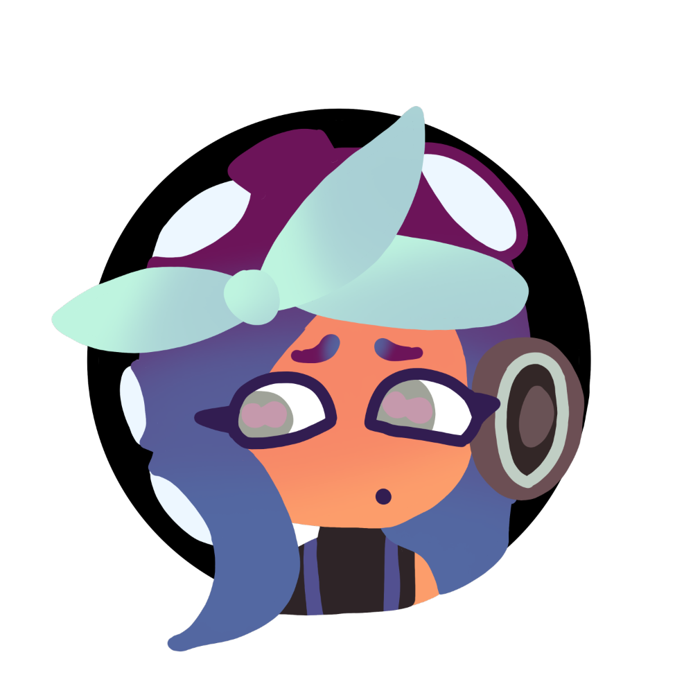
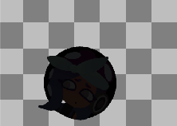
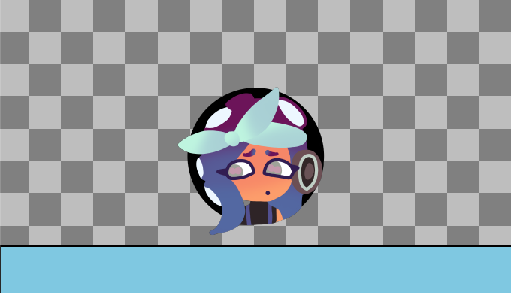
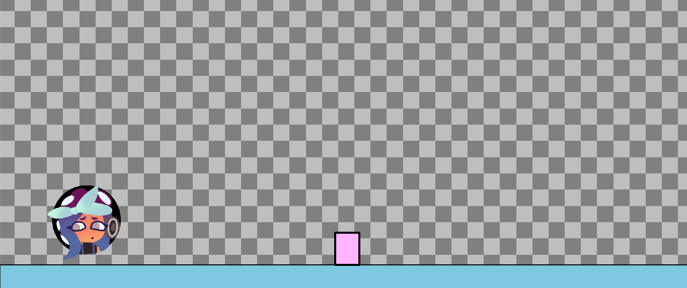
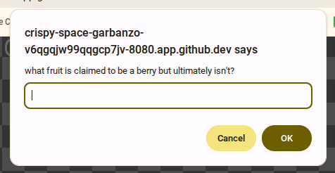

# Tool Learning Log

## Tool: JSON APIs (Geogle)
## Project: Wordle-Inspired Geography Game (Geogle)
### 09/29/25 - 10/06/25:

* [Main source of Data = GeographQL](https://geographql.netlify.app/)

----------------------------------------------------------------------------------------------------------------------------------------------------------------------------------------------------------

## Tool: Kaboom
## Project: Spanish based Platformer
### 10/27/25 - 11/03/25:

**[Entrance to Kaboom:](https://kaboomjs.com/)**

* Kaboom is a good Javascript Supported software in order to make things such as platformers. I've decided to change from my original idea and instead shift to a platformer that emphasizes the knowledge of Spanish.

For my session of Tinkering, I'm trying to, using the tutorials Kaboom provides, create something that takes on the basics of what Kaboom offers. For this, I've chosen to try and code a bit of a Chrome Dinosaur game found in oje of Kaboom's tutorials, one that doesn't need a lot of effort, but enough to show what could be done with the tool. As of now I've been trying to initiate the tool, and here's my code right now:

```js
kaboom();

loadSprite("bean", "sprites/bean.png");
add ([
	sprite("bean");
	pos(75,50)
])
```
The little indicators or simple enough, but just in case I forget `kaboom();` is what gets the code in it's necessary context and `loadSprite();`, as the name says, loads up whatever sprite you choose for your game. I think what I find the most interesting so far is the fact that `add([])` in Kaboom seemingly functions a little similarly to Functions, whereas they both usually take code inside of themselves and act upon it when fully declared. Neat. However, I must stress that in order to use Kaboom more easily, you need to make sure to initalize usage properly. Admittedly I struggled on that a little, trying to see why I wouldn't find the checkered background associated with Kaboom when using `http-server`, but I was able to figure out that the initalizing code must be placed in an `.html` file, so that helped with making the code function.

----------------------------------------------------------------------------------------------------------------------------------------------------------------------------------------------------------

## Tool: Kaboom
## Project: Spanish based Platformer
### 11/10/25 - 11/17/25:

**[Entrance to Kaboom:](https://kaboomjs.com/)**

So, good news! I think it might be best if I forgo using a `.js` file for this tool as I can load everything perfectly on a `.html` file. Anyways, I decided to continue on with the progress I was making before, with the chrome dinosaur game. Last time I managed adding the default sprite to the default checkerboard pattern background using `add([])` as well as `loadSprite()`, but since I decided to shift to a `.html` file for Kaboom's code, I decided to try and add in my own sprite using the same code, so with that, I present Marina!

</img>

The woman in this sprite isn't my own creation admittedly, and instead she's from one of my favorite video game franchises (Splatoon), but I thought it would be cool to tinker with her sprite! With that said, the next part of this tutorial gives insight on using some properties you'd actually see in CSS:

```js
loadSprite("marina", "marina-sprite.png");
add([
    sprite("marina"),
    pos(80,50),
    scale(.5),
    rotate(30),
    color(25,25,25),
]);
```
I never knew that Kaboom includes CSS Properties, but now that I do know I'm certainly more than impressed! Now, the 3 new properties as seen in this miniature chunk of code functions just how you'd expect:

* `scale(),` - *Input a scale size of your choosing on a sprite. Any values > 1 will make the sprite dilate in size, while any values < 1 but more than 0 (such as .5 for half or .25 for a quarter) will make the sprite compress.*
* `rotate(),` - *Makes the sprite rotate on a simple degree scale. What I've noticed for this command is the fact that the sprite seemingly moves in a wider circle while also making it point in a different direction. For example, if I make Marina rotate about 180 degrees, not only will she be upside down, but most of her will also be off the screen.*
* `color(),` - *Simply changes the color of a sprite based on an RBG system. You can add 3 numbers and based off the colors you add, you will see the sprite change.*

With the meanings of these properties listed, here is what they make Marina look like when all put together:



Pretty cool in all honesty. But before we wrap up this session of tinkering, I want to mention one more chunk of code that while not mentioned exactly in the tutorial, I think it'd be nice to jot down now. To be specific, it's a chunk of code that lets you move your sprite:

```js
const spriteMarina = add([
    sprite("marina"),
    pos(80,50),
    scale(.5),
    area(),
    body(),
])
const moveSpeed = 230;
onKeyPress("right", () => {
    spriteMarina.move(moveSpeed,0)
})
onKeyPress("left", () => {
    spriteMarina.move(-moveSpeed,0)
})
```
In order to make your sprite can actually move, you'd need to make a variable that holds your sprite. In this case, I used `spriteMarina` as my variable since it lets me know that what I'm doing is for, well.. Marina. Before I can think of using the movement code, I need to make sure I not only define how fast she'd move (using another vairable called `moveSpeed`) but I also need to consider what key on a keyboard will make her move. For this test, I decided to use only the left and right arrow key and plugged it into `onKeyPress`, which has a self explanatory name. I cannot stress how important it is to imagine the checkerboard as a coordinate plane, as a `moveSpeed` with a negative sign attached to it will make it go left, while a poisitive `moveSpeed` will make it move right. I know you can also make your sprite jump by using similar code and instead of including the movement speed variable as well as `.move()`, you use `.jump()`.

----------------------------------------------------------------------------------------------------------------------------------------------------------------------------------------------------------

## Tool: Kaboom
## Project: Spanish based Platformer
### 11/17/25 - 11/24/25:

**[Entrance to Kaboom:](https://kaboomjs.com/)**

As mentioned last time, you can make a sprite "jump" by using the `.jump()` command, but it should be known that in order to properly use this command, you'd need to set some gravity, specifically through `setGravity()`, otherwise the sprite couldn't move. However even with that' you'd have problems. Since the sprite doesn't have a place to land, they'd be bound to fall indefinitely. For this, we can counter act it by adding a platform, as introduced in the Chrome Dinosaur project!

```js
add([
    rect(width(), 48),
    pos(0, height() - 48),
    outline(2),
    area(),
    body({ isStatic: true }),
    color(127, 200, 225),
])
```
As seen in this piece of code, you can create a platform by first defining the width and height of the platform, but also making sure the platform has `area()` and `body({isStatic: true})` connected to it, or else the sprite won't be able to land on it and use it as, well.. a Platform. `outline()` represents the border thickness of the platform, and the `height()` and `width()` that happen to be trapped inside of other commands (`rect()` & `pos()`), their function is genuinely self-explanatory. But when it's all put together you should see.. This!:



```js
add([
    rect(48, 64),
    area(),
    outline(4),
    pos(width(), height() - 48),
    anchor("botleft"),
    color(255, 180, 255),
    move(LEFT, 240),
    "tree"
]);
```

Last but not least, take a look at this code: Notice how it posesses similar commands to the one that forms the platform, but the main difference here is `anchor()` and `move(LEFT,240)`. `anchor()` in this circumstance represents the fixed position of a certain item: This could include sprites, but more likely than not you'd find this on platforms, or in this case.. Obstacles for the player. Now the `move(LEFT,240)` is pretty interesting: From what I'm understanding, `LEFT` is what controls an item to automatically travel from the right end of the screen to the left, and with `anchor()`, it consistently locks the item into moving in that pattern. Very cool!

----------------------------------------------------------------------------------------------------------------------------------------------------------------------------------------------------------

## Tool: Kaboom
## Project: Spanish based Platformer
### 12/01/25 - 12/08/25:

**[Entrance to Kaboom:](https://kaboomjs.com/)**

For this week, I decided to take the obstacles from the last session of tinkering and try to find a way to make them spawn in repeatedly. This can easily be done through a `loop({})` (Not to confuse it with the concept of **LOOPING** in Javascript.), which, as the name implies, causes an event to loop for long periods of time. By taking the original code from the "Tree" and implementing it into the loop command:

```js
loop(3, () => {
    add([
        rect(48, 64),
        area(),
        outline(4),
        pos(width(), height() - 48),
        anchor("botleft"),
        color(255, 180, 255),
        move(LEFT, 240),
        "tree"
    ]);
})
```

The obstacle will now spawn in at an established rate (For me, I had set this loop to 3 seconds, meaning that an obstacle will spawn every 3 seconds). That does sound a lot more interesting than before for sure, but but what happens when your sprite actually **HITS** an obstacle?



Well.. Nothing. If we look at this chunk of code, we establish that a hitbox has been established for the obstacle, but when the player sprite tries to approach it and fail to jump, all that happens is the sprite phases through the obstacle. For this little *WIP* game, I want to make it so the player gets notified they had hit something, and even get a punishment for failing to dodge it. Thankfully, there is a chunk of code that does exactly that: `.onCollide({})`. This command does exactly what I just described, taking 2 entities with a established hitbox and declaring what were to happen upon them colliding. However, it is important to note that you should absolutely make a tag under the obstacle or the other colliding force (not the sprite) in order for this to work, hence why the obstacle code has *"tree"* connected to it. With that said, take a look at this:

```js
spriteMarina.onCollide("tree", () => {
    addKaboom(spriteMarina.pos);
    shake();

})
```

This code declares that when the player sprite (Marina) were to collide with the tree, the Kaboom logo would actually appear right where she is, and the screen would shake for a very brief period of time, alerting the player that they made a mistake. This is something I definitely want to use for my final project, but I do know I want to refine this; It might be a bit too early to think so deeply about the game, but I want to establish a life system and if the player fails to answer spanish trivia properly, then they will lose a life and experience the shock. Lose all 3 and then you'll see a gameover screen. Next time, I will be tinkering with some screen development, so I'm excited for that!

----------------------------------------------------------------------------------------------------------------------------------------------------------------------------------------------------------

## Tool: Kaboom
## Project: Spanish based Platformer
### 12/08/25 - 12/15/25:

**[Entrance to Kaboom:](https://kaboomjs.com/)**

This week was absolutely packed with progress! Continuing what I wanted to do last week, I scrolled through Kaboom's catalogue and discovered some code that helps shift the game towards a "Game Over" screen! This can be done through the `scene({})` command, which could be triggered depending on the conditions you set and it'd end up showing you a completely different scene. In my case, I need a "GAME OVER" scene to pop up upon colliding withan obstacle. To do this, I'd need this code:

```js
scene("lose", () => {
    add([
        text("GAME OVER!"),
        pos(center()),
        anchor("center"),
    ])
```

This essentially stops the game and forces the player to look at, well.. The bad ending scene. But this won't be able to trigger itself no no. Since I already have the scene established, now I'd need to give it a trigger. I already said I wanted it to be when Marina collides with one of the "trees", so I went into her `.onCollide({})` code and added in `go("lose");`. This is what that piece of code looks like now:

```js
spriteMarina.onCollide("tree", () => {
    addKaboom(spriteMarina.pos);
    shake();
    // lives--;
    go("lose");
```
Notice how there's also `lives--;` visible. I won't get into that this week, but it'll be extremely important soon. Anyways before I go I want to talk about one more thing. You see, every game has some way of determining how good someone is, commonly through a score counter. To make a score counter in Kaboom it's.. Actually pretty simple. By creating a variable, I'll label it as `score` and giving it a value of 0, then creating another variable that has the value of `score`, the computer can begin to rapidly update itself through `onUpdate(({}))` and by connecting `.text` to your second variable, you have a prompt to score counter! It ends up looking something like this:

```js
let score = 0;
const scoreLabel = add([
    text(score),
    pos(24,24),
])

onUpdate(() => {
    score++;
     scoreLabel.text = score;
```

Pretty cool huh? I'd think so personally but with that the game is pretty much done! Now I do want to try and implement that lives system I mentioned previously, but it's creation is for another day.

----------------------------------------------------------------------------------------------------------------------------------------------------------------------------------------------------------

## Tool: Kaboom
## Project: Spanish based Platformer
### 1/09/26 - 1/16/26:

Hello and Happy New Year! For this Learning Log, I decided to temporarily move away from the original concept and instead focus on further trying to combine Javascript (what I know now at least), with what I've been learning from Kaboom! I once mentioned this in my 2nd Blog, but I essentially wanted to take the `onKeyPress()` command, and combine it with `prompt()` to make it so upon hitting a certain button (I'm focusing on one button specifically this time, F), the user then gets asked a question. I feel like this would be good practice for the final project since I know I want to make it so a certain button officially starts the game itself. Now, my 1st attempt worked.. Somewhat. You see, I was able to make the button and the first prompt did come out properly, but I also added one little option; A number selector to choose the question. Whenever I tried to implement a number however, the program would break and I'd only see a checkered screen.

```js
add([
text("Click either 'F' or 'C' to get a surprise!"),
])

onKeyPress("f", () => {

    var foodQuest = ["What is the most popular food in the world?", "what fruit is claimed to be a berry but ultimately isn't?", "What food is commonly eaten in Japan?"];

    var questAn = prompt("Please input a number from 0-2");

    if (questAn === 0) {
      prompt(foodQuest[0]);
        if (prompt === "rice") {
            alert("Correct Answer!");
        } else {
            alert("Oops! Refresh the page to try again!");
        }
    }

})
```

This is my first attempt since I wanted to focus on one question only, and you can see how small but complicated the code is; For one, I don't have a new variable attached to the prompt so would it really go through? Not sure. For my second attempt, I decided to try and scrap the 2nd prompt, and instead focus on just delivering a question upon hitting the 'f' key. For this, the question, one that will be specifically picked from the array I had established, will be the one that I already started implementing; "What is the most popular food in the world?" As already stated in the the code, the answer I'm looking for is "Rice".

```js
add([
text("Click either 'F' or 'C' to get a surprise!"),
])

onKeyPress("f", () => {

var foodQuest = prompt("What is the most popular food in the World?");

if (foodQuest === "rice") {
     alert("Nice job! Rice is the correct answer!.");

} else {
    alert("Sorry, but " + foodQuest + " is not the answer I'm looking for.. Refresh to try again!");
}
```

This second attempt actually works perfectly, but now I want to try and add in the other questions so the user doesn't automatically get the same food question. To do this I'll try to use `Math.random()` while also using the original array since it has all of the original 3 questions.

```js
add([
text("Click either 'F' or 'C' to get a surprise!"),
])
var foodQuest = ["What is the most popular food in the world?", "what fruit is claimed to be a berry but ultimately isn't?", "What food is commonly eaten in Japan?"];

onKeyPress("f", () => {
var randomQuest = Math.ceil(Math.random() * (foodQuest.length - 1));
if (randomQuest == 0) {
  var ansZero = prompt(foodQuest[0]);
    if (ansZero == "rice") {
        alert("That's Correct!");
    } else {
        alert(ansZero + " is not the correct answer.. Sorry!");
    }
} else if (randomQuest == 1) {
    var ansOne = prompt(foodQuest[1]);
      if (ansOne == "banana") {
          alert("That's Correct!");
      } else {
          alert(ansOne + " is not the correct answer.. Sorry!");
      }
} else {
    var ansTwo = prompt(foodQuest[2]);
      if (ansTwo == "ramen") {
         alert("That's Correct!");
      } else {
        alert(ansTwo + " is not the correct answer.. Sorry!");
      }
}
})
```

This attempt, while it certainly looks gigantic, surprisingly works incredibly well!



<!--
* Links you used today (websites, videos, etc)
* Things you tried, progress you made, etc
* Challenges, a-ha moments, etc
* Questions you still have
* What you're going to try next
-->
